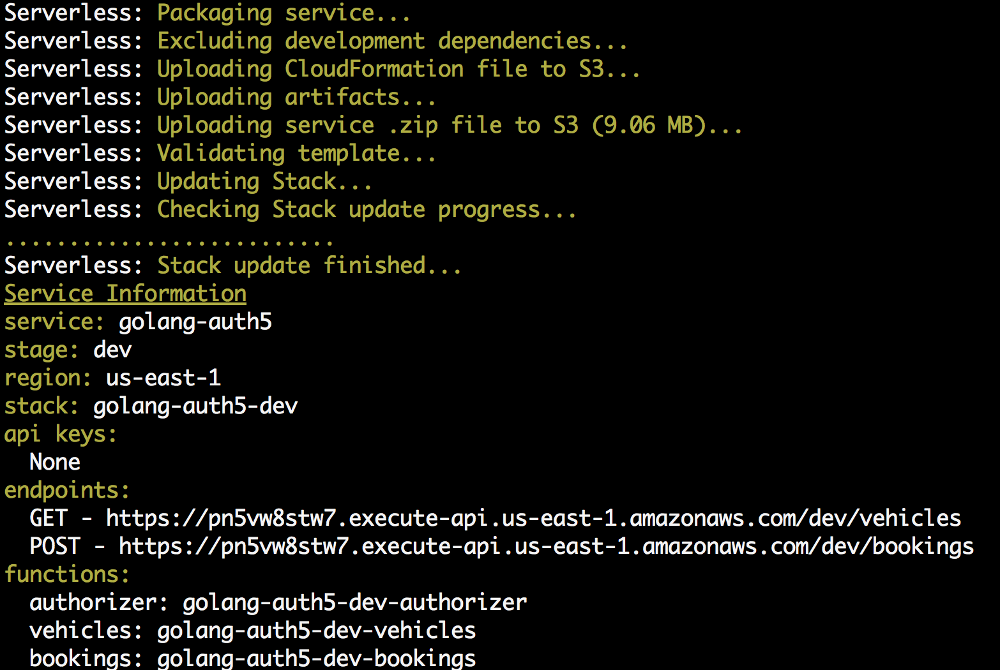

##### Renting the right car at the right price is almost as important as security.

The sample code below can be used to provide backend services for the Okta Car Rental Sample application.

The project relies on Serverless Framework, which is availble here: https://serverless.com

The Serverless framework is not required, But it makes the deployment **Much** easier

If you wish to recompile or change the code, it is written in **GO**, so you will neeed to set that up, however the binaries required to deploy this are included, so it *should* run out-of-box

####Deployment Instructions

* Clone the repository like this     
`git clone https://github.com/pmcdowell-okta/okta-carrental-amazon-apigateway.git`

* If you have GO Language installed, you can compile the code like this, if you are not compiling the code, you can **Skip** this step, don't sweat it    
`make setup`   
`make build`   
The steps above will pull down the required libraries, and build the code

* Deploy the code using Serverless Framework    
`sls deploy`

If everything works as it should, this would push the required Amazon API Gateway, Custom Authorizer, and supporting Lambda Functions. The output should look something like this:

